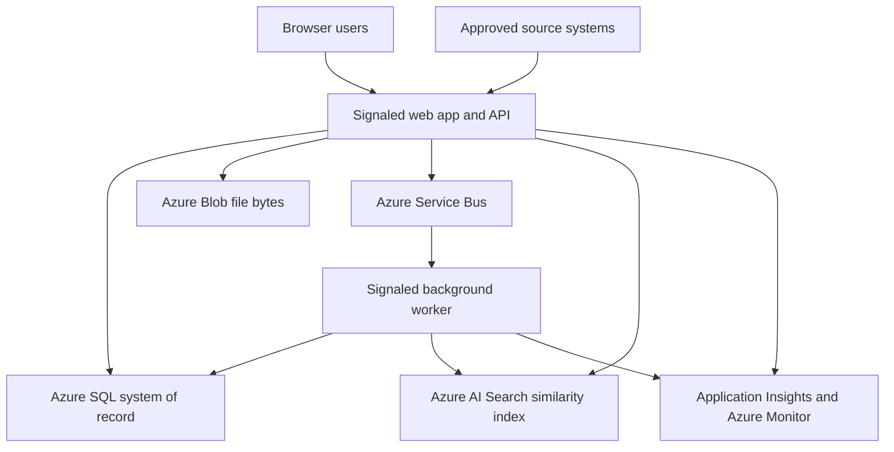
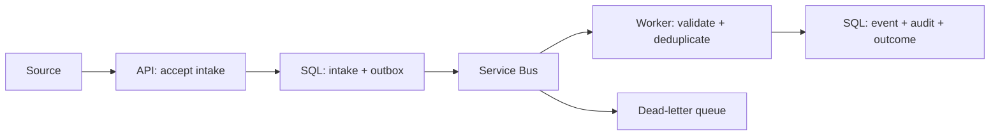

# Signaled MVP Architecture

**Status:** Approved for MVP architecture baseline  
**Date:** September 26, 2026  
**Scope:** Architecture decisions for the approved Signaled MVP; detailed schemas, contracts, permission matrices, and operational policies are specified in their respective documents.

## 1. Purpose and authority

This document defines how Signaled implements the approved event-to-resolution lifecycle. It is subordinate to the [MVP requirements](../requirements/signaled-mvp-requirements.md), [user stories](../requirements/signaled-user-stories.md), [product brief](../product/Signaled-Product-Brief.md), and [user flows](../design/signaled-user-flows.md). The approved high-fidelity mockups in `../design/mockups/` guide the web interface, but generated example text, counts, and roles do not change business rules.

Architecture choices here are the MVP baseline. Exact fields, endpoints, authentication configuration, permission catalog, thresholds, and policies remain obligations of the later data, API, security, testing, and deployment documents. A change to an approved requirement requires an explicit requirements decision, not a silent architecture adjustment.

## 2. System shape

Signaled is one primary deployable **ASP.NET Core modular monolith** with a browser-based user interface and an authenticated HTTP API. Domain modules live within the same application and transactional database; they are not separately deployed services. A separate background worker runs only approved asynchronous work, reusing the same application and domain rules. The worker is a processing host, not an independent business service.

Azure Container Registry holds the built images. Azure Key Vault holds deployed secrets. Azure App Configuration holds centralized non-secret environment settings. Both hosts use managed identities where supported. Azure SQL, not the search index or message queue, remains authoritative for events, cases, identities, decisions, and audit history.

### 2.1 Modules and responsibilities

| Module | Owns | Important boundary |
| --- | --- | --- |
| Identity and access | Local user/service-identity state, grants, authorization policies | External identity provider authenticates; Signaled checks active state, permission, and record scope on every protected operation. |
| Events | Drafts, submissions, immutable submitted content, follow-up, triage decisions | A submitted event survives even if no case is created. |
| Cases | Case creation, event links, ownership, priority, due date, transitions | Investigator work and Supervisor decisions follow one case lifecycle. |
| Investigation | Notes, findings, rationale, review package | Corrections preserve earlier content and history. |
| Evidence | File metadata, association, access, correction/removal history | Blob bytes are separate; access always goes through an authorized application operation. |
| Search and summaries | Structured queries, permitted aggregations, similarity lookup | Search is an aid, never a decision maker or permission authority. |
| Administration | User and service access, designated runtime settings, operational views | Cloud resource administration and secrets remain deployment-managed. |
| Audit | Append-only significant-action records and permitted read-only review | Ordinary application actions cannot edit or delete audit entries. |
| Ingestion | Authenticated source submission and deduplication | Source systems cannot gain investigative or human permissions by ingesting. |

These are logical modules in one solution, not a mandate for one project per module. Each module has explicit application commands/queries and owns its rules; direct cross-module database writes are disallowed. Cross-module read composition may query permitted projections through application services.

## 3. Code boundaries and dependency direction

The solution separates **Domain**, **Application**, **Infrastructure**, and **API/web host** responsibilities. Domain contains entities, invariants, value objects, and permitted transition rules. Application coordinates use cases, policy checks, transactions, audit intent, and interfaces for external resources. Infrastructure implements EF Core persistence, Blob Storage, Service Bus, search, configuration, and identity integrations. The API/web host handles transport, authentication middleware, request validation, response mapping, and dependency injection. The worker host executes application use cases with its own identity and telemetry.

Dependencies point inward: API and Infrastructure depend on Application/Domain; Application depends on Domain and owns interfaces used by Infrastructure; Domain depends on neither Azure nor EF Core. Use cases are explicit, such as `SubmitEvent`, `RecordTriageDecision`, `CreateCase`, `SubmitForReview`, `CloseCase`, and `ProcessIngestedEvent`. Authorization, validation, error mapping, and correlation are shared patterns; they are still enforced in each use case, including worker-triggered ones.

The browser interface will implement the locked Signaled design system with ivory page backgrounds and dark main text. It consumes the same authorized application/API operations. Client-side hiding of actions improves usability but never replaces server enforcement. The frontend framework and asset-serving arrangement can be selected during implementation without changing the architecture or user flows.

## 4. Persistence and consistency

**Azure SQL Database with EF Core** is the deployed transactional store; local development uses SQL Server with the same mappings/migrations. Stable internal identifiers are distinct from display identifiers such as `EVT-...` and `CAS-...`. The data model will define entities, constraints, indexes, concurrency tokens, and the authoritative lifecycle states. List queries are paginated and scoped before totals or summaries are calculated.

One business command commits its state change, required audit entry, and any outgoing work intent in a single SQL transaction. An **outbox table** records messages destined for Service Bus; a publisher sends and marks them dispatched with retries. This avoids reporting success while losing the work request if SQL commits and messaging fails. Service Bus delivery is at least once, so consumers must be idempotent. A dispatch failure remains visible and retryable; the operation's state describes whether downstream work is pending, complete, or failed.

Use optimistic concurrency for records that may be edited by multiple people; reject stale changes and ask the user to refresh rather than silently overwrite. Enforce uniqueness for case-event associations and external-source idempotency keys at the database level. Audit entries are append-only through application operations and committed with the business action; access to alter the audit store outside the application is restricted operationally and addressed by the security design. A case's timeline is a permitted view over business history and audit data, not a substitute for the durable audit record.

Corrections to submitted events, notes, findings, links, evidence metadata, and decisions create explicit subsequent actions with actor, reason when required, and timestamps. No ordinary user workflow hard-deletes the authoritative history. Organization-specific legal retention/disposition is outside MVP.

## 5. Event and case workflows

### 5.1 Human event intake and triage

Contributors save editable drafts, add validated attachments, and submit only when required information is complete. Submission preserves the original snapshot. Investigators see only events in their permitted scope, inspect supporting information, request documented follow-up, and record a rationale with either **complete review without case** or **escalate for case creation**. A follow-up response is an addition, not an overwrite. The exact event state names and whether escalation and case creation are one API operation belong to the data/API documents; the user-visible outcome must be consistent and audited.

An Investigator creates a case from an eligible triaged event. The case and originating association are written atomically; additional event links and unlinks preserve association history. A Supervisor assigns or reassigns an active Investigator. Investigators add notes, evidence, and findings and submit a complete case for Supervisor review. Review-controlled content is frozen while awaiting review. A Supervisor returns it with a reason or closes it with documented resolution; reopening preserves the previous closure and requires a reason. Transition permission and preconditions live in application/domain rules and are verified server-side.

### 5.2 External ingestion: selected asynchronous workflow

The approved long-running workflow is **external event ingestion**. An approved source submits a validated envelope using a narrowly scoped service identity and a source identifier/idempotency key. The API validates basic shape and authorization, durably records the intake request and outbox entry, then returns an accepted operation reference. It does not claim the event has been created until processing succeeds.

The outbox publisher posts a message to **Azure Service Bus**. A **separate .NET background worker hosted in Azure Container Apps** consumes it, validates the full payload, checks the source/idempotency constraint, creates the event and audit entry transactionally, and records the processing result. Equivalent duplicate deliveries return the prior result. Conflicting reuse of a source key is rejected and observable. The worker does not bypass normal creation rules because its caller is a service identity.

Transient failures retry with bounded backoff. Invalid payloads and authorization failures are permanent failures and do not loop indefinitely. Exhausted messages go to the Service Bus dead-letter queue with safe operation, source, and correlation references; an authorized Administrator can inspect the outcome and initiate controlled reprocessing after correction. Reprocessing uses the same idempotency key. Exact retry counts, lock settings, and operator procedure belong to operations documentation. Worker scaling follows Service Bus backlog independently of interactive API scaling.

The background worker is chosen over an Azure Function for MVP because it can use the same C# application modules, deployment pipeline, and container platform while keeping ingestion off request threads. This fulfills the requirements' **Function or worker** alternative without adding a second compute model.

## 6. Evidence and file lifecycle

Azure Blob Storage holds private file bytes; SQL holds association, owner, blob reference, file name, content type, size, uploader, timestamp, state, and audit history. The API validates request and file limits and stages the upload. It marks a file usable only after Blob storage succeeds and the metadata transaction completes. Failed staging is cleaned up or surfaced for recovery; a missing blob behind completed metadata is reported and flagged, never silently treated as valid evidence. Authorized removal changes the visible state and records the reason/history; irreversible disposal is outside normal MVP workflows.

Downloads are mediated by the API or by a short-lived, narrowly scoped access mechanism issued only after checking the associated event/case scope. A guessed blob path must not grant access. Metadata and content authorization apply equally to search, previews, and direct links. File type/size allowlists, malware-handling policy, and evidence-access audit policy are set by the security document before implementation of uploads; this architecture does not assert unapproved values.

## 7. Search and operational summaries

Structured event/case search and role-filtered summaries query **Azure SQL**, using indexes, bounded filters, pagination, and authorization predicates before counts are returned. Investigators and Auditors search permitted history within their distinct rights; Auditor operations stay read-only. Supervisor workload and trend summaries derive from the same permitted transactional records. Avoid a separate warehouse or reporting service in MVP.

For the approved similar-incident use case, **Azure AI Search** holds a derived vector index of approved event narratives and case synopsis text. The index stores stable record references, record type, indexing version, and only the minimum text/metadata needed for similarity. A worker publishes updated index documents from committed records through outbox-driven work; indexing can lag without blocking event or case commands. Index failures are observable and retryable. The embedding model/service and costs are deployment decisions to be recorded before provisioning, and only approved investigative text may be sent to it. This dedicated search service is justified by `REQ-SRC-006`, not a general AI feature.

The API applies the signed-in user's visibility scope to the search query where expressible, then checks every candidate against the current SQL authorization state **before** returning identifiers, snippets, counts, or relevance. It retrieves additional candidates as necessary to fill a page without leaking the number or existence of denied records. Permission changes must affect results immediately through this final check, even if the index is stale. Similarity never creates links, classifies events, assigns work, or writes findings. If the embedding or search service fails, structured search and investigation remain available. Index rebuilds are possible from authoritative SQL records.

## 8. Identity, authorization, and privacy boundary

An enterprise identity provider authenticates human users; its exact choice, token flow, invitation/provisioning semantics, session policy, and trust configuration are finalized in the security design. Signaled stores a stable user reference, active/disabled state, role/permission grants, and administrative history in SQL. Disabling a user or revoking a service identity is enforced on protected operations without rewriting prior actor identities. Service identities authenticate separately and receive only the ingestion or processing permissions needed for their purpose. Azure workload managed identities are distinct from Signaled's own business-level service-identity records.

Each operation checks authentication, active identity, action permission, and record scope. Query scoping is applied before pagination and aggregation; individual reads and file accesses check again. A denied direct lookup must not reveal whether a forbidden record exists. The security document defines the complete permission matrix and any department/team visibility beyond Contributors' permitted access to their own events. Until that matrix is approved, no design may assume broad cross-team access simply because a mockup displays it.

Secrets stay out of source control, API responses, logs, and the Configuration UI. Use encrypted transport and Azure encryption at rest; grant Azure resources and deployed identities the minimum necessary access. The security design will specify sensitive-field/logging policy and upload safeguards.

## 9. Configuration ownership

Three categories prevent the Administration → Configuration screen from becoming an Azure control panel:

| Category | Owner and store | Signaled UI |
| --- | --- | --- |
| Secrets, credentials, connection material | Deployment identity/Key Vault | Never editable or exposed. |
| Environment/deployment settings and service endpoints | Deployment pipeline/App Configuration; non-secret values only | At most carefully justified read-only status. |
| Approved application runtime policies | Signaled Administrator; validated SQL-backed settings with change history | Editable only if a later security/data/API decision explicitly designates them. |

The hosts load environment settings through the ASP.NET Core configuration pipeline; Azure App Configuration centralizes justified non-secret settings. Managed identity grants access to App Configuration/Key Vault where supported. App-managed settings are stored in SQL so the authorization, validation, concurrency, and audit requirements apply in one transaction; deployed infrastructure configuration remains outside that path. An application setting cannot override a deployment security ceiling. Changes must have defined validation and effective-time behavior; no arbitrary key/value editor exists.

The specific editable settings, including whether file size and type limits have an Administrator-adjustable subset, are deliberately **not approved yet**. Architecture supplies the ownership boundary; the security, data model, and API documents supply the catalog and rules. Finalize `administration-configuration.png` only then. Operational health may appear read-only if the later operational design can provide reliable, appropriately authorized signals; mockups must not imply that Signaled edits Azure resources.

## 10. Observability and operations

OpenTelemetry instruments HTTP requests, SQL dependencies, Service Bus publication/consumption, worker outcomes, Blob operations, and search calls. Export deployed traces, metrics, and structured logs to **Application Insights/Azure Monitor**. Carry a correlation identifier from intake or interactive request through outbox, Service Bus, worker, business persistence, and diagnostic outcome. Audit records use the same correlation reference where applicable but are not interchangeable with diagnostic logs.

Expose separate liveness and readiness checks. Readiness covers dependencies critical for the host's function, without making a temporary optional similarity-search outage take down core event/case access. Track failed requests, auth denials without sensitive details, outbox age, processing lag, retry/dead-letter counts, failed/missing blobs, index freshness, and dependency errors. Operational documentation will provide KQL examples for an end-to-end ingestion trace and common failure investigation. Sanitized telemetry never contains secrets or unnecessary narrative/evidence content.

An Administrator can inspect relevant operation status and correlation references through permitted views, but direct cloud management remains an operational/deployment responsibility. Explicit recovery actions, including dead-letter replay, require restricted authorization and audit.

## 11. Delivery and deployment

Build a versioned Docker image for the web/API host and a worker image from the same solution. CI restores, builds, runs focused automated tests and security-sensitive gates, and produces images in **Azure Container Registry**. CD deploys the API and worker to **Azure Container Apps**, applies reviewed EF Core migrations through a controlled deployment step, injects environment-specific configuration without code edits, verifies health/readiness, and reports failure accurately. Azure SQL, Blob Storage, Service Bus, Key Vault, App Configuration, AI Search, and telemetry resources are provisioned as defined by deployment documentation. Local development uses SQL Server plus documented local or development substitutes for external dependencies; no production secrets are committed.

The API is stateless with respect to durable business information; multiple replicas share SQL, Blob Storage, Service Bus, and the index. The worker scales separately with message load. No AKS, microservice split, Redis, Cosmos DB, Event Grid, generic chatbot, or organization-specific legal-disposition workflow is added to MVP.

## 12. Validation and traceability

| Architecture obligation | Requirement coverage | Evidence before MVP acceptance |
| --- | --- | --- |
| Permission and record scoping | `REQ-AUTH-*`, `REQ-SEC-*`, `REQ-UI-*` | Role and denied-record tests across direct reads, search, summaries, and files. |
| Event → case → review lifecycle | `REQ-EVT-*`, `REQ-TRI-*`, `REQ-CASE-*`, `REQ-ASG-*`, `REQ-WFL-*`, `REQ-INV-*`, `REQ-RES-*` | Domain transition tests and complete functional flow. |
| Evidence integrity | `REQ-EVD-*` | Upload validation, failed storage, missing blob, correction, and denied-access tests. |
| Ingestion and messaging | `REQ-ING-*`, `REQ-ASY-*` | Duplicate delivery, transient/permanent failure, DLQ, replay, audit, and correlation tests. |
| Structured/semantic search | `REQ-SRC-*`, `REQ-RPT-*` | Scope, stale-index, unavailable-search fallback, and authorized-summary tests. |
| Audit and administration | `REQ-AUD-*`, `REQ-ADM-*`, `REQ-CFG-*` | Atomic business/audit persistence, immutable history, disabling, and settings validation tests. |
| Reliability, operations, deployment | `REQ-REL-*`, `REQ-PERF-*`, `REQ-OBS-*`, `REQ-MNT-*`, `REQ-TST-*`, `REQ-DEP-*` | Migration, conflict, health, telemetry, CI/CD, and measured deployed-performance results. |

The testing document will set measurable API and ingestion processing targets and representative workloads before acceptance, as required by `REQ-PERF-001/002/007`. This document intentionally does not invent those numbers.

## 13. Decisions owned by subsequent documents

| Document | Decisions it must settle before the affected implementation |
| --- | --- |
| ERD/data model | Entity and audit schemas, event/case states, association history, outbox/inbox, indexes, concurrency, app-setting schema, exact fields. |
| API contract | Commands and query endpoints, versioning/error shapes, ingestion envelope/idempotency key, upload flow, pagination, operation-status contract. |
| Security design | Identity provider/flows, human and service permission catalog, record scope, secret and file policies, evidence-access logging, session and audit policy. |
| Testing/operations/deployment | Performance targets, retry/DLQ policy, replay procedure, observability/KQL, migration and rollout procedure, embedding service choice and cost guardrails. |
| Final Configuration mockup | Only the administratively editable settings and read-only signals actually approved by the preceding designs. |

**Architecture change rule:** If one of these documents exposes a conflict with an approved requirement or this baseline, record the decision and update the owning artifact before implementing the conflicting behavior.

## 14. Technology references

- [Azure Container Apps scaling](https://learn.microsoft.com/en-us/azure/container-apps/scale-app) and [jobs versus continuously running apps](https://learn.microsoft.com/en-us/azure/container-apps/jobs) support the separately scaled worker choice.
- [Azure AI Search vector query filters](https://learn.microsoft.com/en-us/azure/search/vector-search-filters) describe filtering within the derived similarity index; Signaled still performs its own authoritative authorization check.
- [Azure App Configuration .NET provider](https://learn.microsoft.com/en-us/azure/azure-app-configuration/reference-dotnet-provider) and [managed identity access](https://learn.microsoft.com/en-us/azure/azure-app-configuration/howto-integrate-azure-managed-service-identity) support the environment-configuration boundary.
