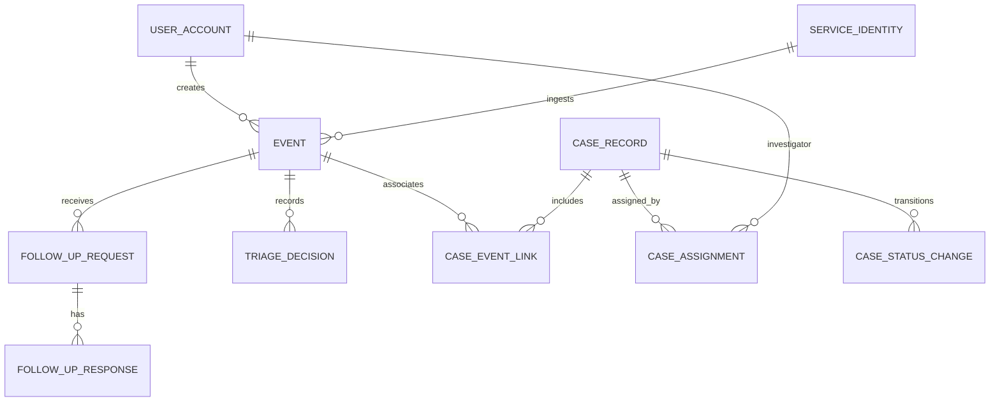
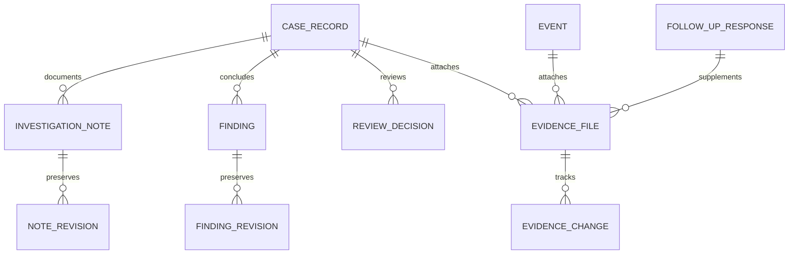
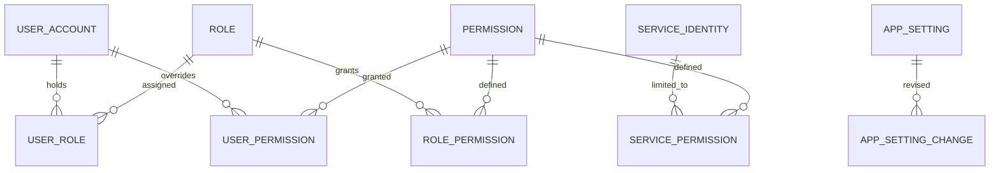
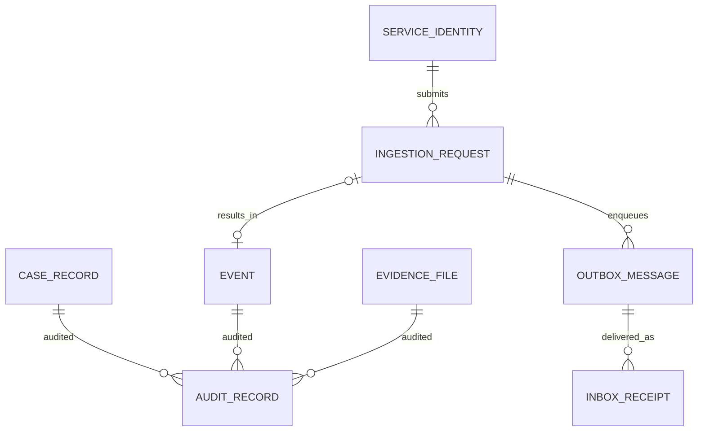

# Signaled MVP ERD and Data Model

**Status:** Approved for MVP  
**Date:** September 26, 2026  
**Purpose:** Define the authoritative relational model and integrity rules for the approved Signaled MVP.

## 1. Scope and conventions

This document implements the [MVP requirements](../requirements/signaled-mvp-requirements.md), [user flows](../design/signaled-user-flows.md), and [architecture baseline](signaled-mvp-architecture.md). It defines tables, key fields, relationships, lifecycle storage, and constraints sufficiently to begin EF Core modeling. SQL Server locally and Azure SQL in deployment use the same migration history. The Mermaid diagrams show relationships; the tables and invariants below are authoritative if a diagram omits a field.

The names here are logical table names. EF Core mapping may change casing and physical naming, but must preserve these relationships and constraints. `PK` means primary key; `FK` means foreign key; `UQ` means unique constraint. A `?` denotes nullable. Every timestamp is UTC (`datetimeoffset` or a consistent UTC mapping); display time zones are a UI concern. Internal keys use stable `uniqueidentifier` values; display IDs are separately generated, unique, and immutable. Text lengths, enum storage, indexes, and SQL constraint syntax will be fixed in migrations, with the minimum checks described here.

`Actor` in this document means **exactly one** of `ActorUserId`, `ActorServiceIdentityId`, or a documented internal system actor on an action. Internal service execution on behalf of an external submitter records both the external service identity and processor context; it must not be attributed to a human. A FK to a user or service identity uses `NO ACTION`/restricted delete, never cascade deletion of historical records.

## 2. Core event and case relationships

One event can have several historical case links and one case can contain several events. Only one active link for a given pair is allowed. An event may be reviewed without any case. The case's originating event always has a link marked `Origin`, which ordinary unlink operations cannot deactivate.

### 2.1 Event and triage tables

| Entity | Key fields | Purpose and constraints |
| --- | --- | --- |
| `Event` | `Id` PK; `EventNumber` UQ; `Title`, `Description`, `OccurredAt`, `CreatedAt`, `SubmittedAt?`, `IngestedAt?`, `Status`, `SourceType`, `SourceSystem?`, `CreatedByUserId?` FK, `CreatedByServiceIdentityId?` FK, `RowVersion` | Holds the editable draft until submission and the original submitted narrative thereafter. A human-created event has a user creator; an ingested event has a service creator. `OccurredAt`, narrative, and any other required fields are validated before submission. Source and ingestion timestamps remain available for externally created records. `SubmittedAt` is set once. |
| `EventStatusChange` | `Id` PK; `EventId` FK; `FromStatus`, `ToStatus`, `ChangedAt`, actor, `Reason?` | Append-only record of status changes. Business status on `Event` is the current projection. |
| `FollowUpRequest` | `Id` PK; `EventId` FK; `RequestedByUserId` FK; `RequestedAt`, `Prompt`, `Status`, `ClosedAt?`, `RowVersion` | A documented request on a submitted event. It may receive more than one response if the use case allows clarification; a closed request cannot accept another response. |
| `FollowUpResponse` | `Id` PK; `RequestId` FK; `RespondedByUserId` FK; `RespondedAt`, `ResponseText` | Additive response from an authorized Contributor. Requester and responder are never overwritten. File attachments can point to this response through the evidence association described below. |
| `TriageDecision` | `Id` PK; `EventId` FK; `Outcome`, `Rationale`, `DecidedByUserId` FK; `DecidedAt`, `CorrectsDecisionId?` FK | Append-only decisions, including explicit documented corrections. `Outcome` is `OpenCase` or `NoCase`. The latest valid decision is current; a correction retains its predecessor. An `OpenCase` outcome authorizes a case creation but does not itself falsely claim a case already exists. |

The event's submitted content cannot be changed by normal editing. If an authorized correction is needed later, add an explicit versioned correction record (not an update to the submitted narrative), actor, reason, and audit entry. `EventAmendment(Id, EventId, FieldName, PriorValue, NewValue, Reason, actor, AmendedAt)` is the baseline history structure; the security design determines which fields may be amended and which prior/new values must be redacted from audit output. Draft changes remain ordinary edits with concurrency protection until submission.

### 2.2 Case, linking, and assignment tables

| Entity | Key fields | Purpose and constraints |
| --- | --- | --- |
| `CaseRecord` | `Id` PK; `CaseNumber` UQ; `Title`, `Synopsis`, `OriginEventId` FK, `Status`, `Priority`, `DueAt?`, `CurrentInvestigatorId?` FK, `CreatedByUserId` FK; `CreatedAt`, `ClosedAt?`, `RowVersion` | Current case projection. Creation requires an eligible originating triage decision and inserts the `Origin` link in the same transaction. `CurrentInvestigatorId` is null until assigned and must reference an active Investigator when set. `ClosedAt` reflects current closure state; prior closure episodes remain in `ReviewDecision`/status history. |
| `CaseEventLink` | `Id` PK; `CaseId` FK; `EventId` FK; `Kind` (`Origin` or `Related`); `LinkedByUserId` FK; `LinkedAt`, `UnlinkedByUserId?` FK, `UnlinkedAt?`, `UnlinkReason?` | One row per period of association. Preserve unlinked rows. Filtered UQ on `(CaseId, EventId)` where `UnlinkedAt IS NULL`; at most one origin link per case. The origin link cannot be unlinked through ordinary operations. Relinking creates a new row. |
| `CaseAssignment` | `Id` PK; `CaseId` FK; `InvestigatorUserId` FK; `AssignedByUserId` FK; `AssignedAt`, `EndedAt?`, `EndReason?` | Historical assignment intervals. At most one open interval per case; on reassignment close prior interval and insert next one atomically, updating `CurrentInvestigatorId`. Only an active permitted Investigator is eligible. |
| `CaseStatusChange` | `Id` PK; `CaseId` FK; `FromStatus`, `ToStatus`, `ChangedAt`, actor, `Reason?` | Append-only transition history. Insert in same transaction as `CaseRecord.Status` change and audit entry. |
| `CasePriorityChange` | `Id` PK; `CaseId` FK; `FromPriority`, `ToPriority`, `FromDueAt?`, `ToDueAt?`, actor, `ChangedAt`, `Reason?` | Preserves changes to priority and due date, including null/non-null changes. |

Case and event identifiers are display values only; joins and authorization checks use PKs. Foreign keys prevent links to nonexistent records. A unique originating-event link across different cases is **not** assumed: the approved requirements permit multiple events per case but do not explicitly forbid an event from appearing in another case. The API/security design may tighten this only through an approved business decision.

## 3. Investigation, evidence, and review

The three possible file associations in this diagram are alternatives: each file belongs to **exactly one** event or case; a file on a follow-up response also belongs to that response's event, so its `EventId` is populated along with `FollowUpResponseId`. Case views can show linked-event attachments without duplicating Blob content or changing ownership.

| Entity | Key fields | Purpose and constraints |
| --- | --- | --- |
| `InvestigationNote` | `Id` PK; `CaseId` FK; `AuthorUserId` FK; `CreatedAt`, `CurrentRevisionId?` FK, `Status` | Stable note identity and current display state. Review-controlled and closed-case rules restrict changes. |
| `NoteRevision` | `Id` PK; `NoteId` FK; `RevisionNumber`, `Body`, `ChangeKind`, `Reason?`, `ChangedByUserId` FK; `ChangedAt` | Initial content and all later corrections/removals are retained. UQ `(NoteId, RevisionNumber)`; removal is a tombstone revision, not deletion. |
| `Finding` | `Id` PK; `CaseId` FK; `AuthorUserId` FK; `CreatedAt`, `CurrentRevisionId?` FK, `Status` | Stable finding identity. Supporting rationale is required in a revision. |
| `FindingRevision` | `Id` PK; `FindingId` FK; `RevisionNumber`, `Conclusion`, `Rationale`, `ChangeKind`, `Reason?`, `ChangedByUserId` FK; `ChangedAt` | Immutable finding history. UQ `(FindingId, RevisionNumber)`; corrections do not erase the finding reviewed earlier. |
| `EvidenceFile` | `Id` PK; `EventId?` FK; `CaseId?` FK; `FollowUpResponseId?` FK; `OriginalName`, `ContentType`, `SizeBytes`, `BlobReference?`, `Status`, `UploadedByUserId?` FK, `UploadedByServiceIdentityId?` FK, `UploadedAt?`, `CreatedAt`, `RowVersion`, `Classification?`, `Description?` | SQL metadata only; Blob stores bytes. Check **exactly one** of `EventId` and `CaseId`. A follow-up association requires matching `EventId`. `Available` requires successful storage, blob reference, uploader, and upload timestamp. No direct public Blob URL is persisted. |
| `EvidenceChange` | `Id` PK; `EvidenceId` FK; `ChangeKind`, `PriorMetadata?`, `NewMetadata?`, `Reason?`, actor, `ChangedAt` | Append-only metadata updates, authorization-relevant access events when policy requires, failure/missing-blob detection, and authorized removal history. Do not log secret URLs or file bytes. |
| `ReviewDecision` | `Id` PK; `CaseId` FK; `Outcome`, `ReasonOrResolution`, `SupervisorUserId` FK; `DecidedAt`, `ReviewCycle`, `PreviousClosureDecisionId?` FK | Append-only Supervisor return, closure, and reopening decisions. `ReasonOrResolution` is mandatory. A reopen points to the closure episode being reopened; earlier findings and decisions remain intact. |

`CurrentRevisionId` is a pointer to a revision of **the same** note/finding, checked in the domain and in a transaction; if cross-row SQL constraints cannot express this, maintain it through a same-parent composite FK or derive latest revision instead. No cyclic cascading deletes. Evidence `Status` distinguishes staged/pending, available, unavailable, and removed. A failed upload must never be `Available`; unfinished staging can be cleaned up safely and observed. Exact file categories, size limits, and access-audit policy await security design.

### 3.1 Review-controlled state

The current case status and `ReviewCycle` identify the active review episode. Submitting for review verifies required findings, rationale, evidence/notes as prescribed by the later API/business-rule specification, records a transition, and prevents further review-controlled edits. A return decision starts another investigation episode; a subsequent submission increments `ReviewCycle`. Closure stores a Supervisor decision and transition in the same transaction. Reopening records a decision and returns to investigation while retaining the prior closure and all earlier revisions.

## 4. Users, service identities, and app-managed settings

| Entity | Key fields | Purpose and constraints |
| --- | --- | --- |
| `UserAccount` | `Id` PK; `IdentityProviderSubject` UQ; `DisplayName`, `Email?`, `Phone?`, `Department?`, `ManagerUserId?` FK, `Status`, `CreatedAt`, `UpdatedAt`, `LastSignInAt?`, `RowVersion` | Signaled's local account/access projection. `ManagerUserId` can be null. The external subject is immutable. Disabling preserves the account and prior actor references. Contact/org fields support the approved Administration mockup; their collection and editing rules belong to security/API design. |
| `Role` | `Id` PK; `Code` UQ; `Name`, `IsActive` | Five initial human roles: Contributor, Investigator, Supervisor, Administrator, Auditor. No extra `Reviewer` role is created from mockup sample text. |
| `Permission` | `Id` PK; `Code` UQ; `Description`, `AppliesToIdentityType` | Defines actions independently from literal role-name checks. The complete catalog is owned by security design. |
| `UserRole` | `UserId` + `RoleId` composite PK/FKs; `AssignedAt`, `AssignedByUserId?` FK | Current role membership. All assignment/removal changes are separately audited; historical grants can be reconstructed through `AccessChange`. |
| `RolePermission` | `RoleId` + `PermissionId` composite PK/FKs | Current role-to-permission mapping. Changes are audited. |
| `UserPermission` | `UserId` + `PermissionId` composite PK/FKs; `GrantedAt`, `GrantedByUserId?` FK | Optional explicit grant where approved by security design; no implicit deny/override semantics are invented here. |
| `ServiceIdentity` | `Id` PK; `ExternalClientId` UQ; `Name`, `Type`, `Description?`, `Status`, `CreatedByUserId?` FK, `CreatedAt`, `UpdatedAt`, `LastUsedAt?`, `RowVersion` | Business-level trusted identity. Credential material is never stored here; managed workload identity and integration client identity remain distinguishable. Revoke/disable preserves history. |
| `ServicePermission` | `ServiceIdentityId` + `PermissionId` composite PK/FKs | Only grants approved service capabilities; no human role assignment. |
| `AccessChange` | `Id` PK; `TargetUserId?` FK, `TargetServiceIdentityId?` FK; `ChangeKind`, `BeforeSummary?`, `AfterSummary?`, actor, `ChangedAt` | Append-only account, role, permission, and status history. Exactly one target identity; sensitive values are redacted. Audit record for the same change is written atomically. |
| `AppSetting` | `Id` PK; `Key` UQ; `ValueType`, `Value`, `Version`, `UpdatedByUserId` FK, `UpdatedAt`, `RowVersion` | Only allowlisted, non-secret, administratively editable settings. No arbitrary keys or deployment-managed resource settings. |
| `AppSettingChange` | `Id` PK; `SettingId` FK; `PriorValue?`, `NewValue`, `ChangedByUserId` FK; `ChangedAt`, `Reason?` | Immutable, auditable setting history. Validate against registered policy and deployment ceiling before transaction commits. |

User/service permission changes take effect on the next protected operation by consulting current authoritative access state. Tokens alone are insufficient to keep disabled access active. `AccessChange` adds focused admin history; `AuditRecord` remains the canonical cross-system audit trail. There is no schema for password or secret storage and no delete-user action.

The **catalog of keys and whether any are editable** remains open until security and API design. The model provides a safe storage mechanism without approving a Configuration screen control. Environment configuration remains in Azure App Configuration and secrets in Key Vault, not these tables.

## 5. Audit, ingestion, and reliable messaging

| Entity | Key fields | Purpose and constraints |
| --- | --- | --- |
| `IngestionRequest` | `Id` PK; `ServiceIdentityId` FK; `SourceSystem`, `SourceEventKey`, `PayloadHash`, `PayloadReferenceOrEnvelope`, `AcceptedAt`, `Status`, `ResultEventId?` FK UQ, `FailureCode?`, `CompletedAt?`, `CorrelationId`, `RowVersion` | Durable intake operation. UQ `(ServiceIdentityId, SourceSystem, SourceEventKey)`; repeated equivalent request returns same operation/result, conflicting hash is rejected. Accepted is not the same as event created. Store only bounded, validated, protected payload or a private Blob reference; no investigative content in logs. |
| `OutboxMessage` | `Id` PK; `MessageType`, `SchemaVersion`, `Payload`, `OccurredAt`, `CorrelationId`, `RelatedIngestionRequestId?` FK, `DispatchStatus`, `DispatchedAt?`, `AttemptCount`, `LastFailureCode?` | Committed with the business action needing delivery, including ingestion requests and index refresh work. Dispatcher may send more than once; status update follows broker acknowledgment. Dispatch failure remains retryable and visible. |
| `InboxReceipt` | `Id` PK; `ConsumerName`, `MessageId`, `ProcessedAt`, `Outcome`, `BusinessResultId?`, `CorrelationId` | UQ `(ConsumerName, MessageId)` for consumer idempotency. The consumer writes receipt plus business result in one SQL transaction; domain uniqueness still protects against a new message ID carrying the same source key. |
| `AuditRecord` | `Id` PK; `ActionCode`, `OccurredAt`, `ActorUserId?` FK, `ActorServiceIdentityId?` FK, `SystemActorCode?`, `EventId?` FK, `CaseId?` FK, `EvidenceId?` FK, `TargetType`, `TargetId`, `ChangeSummary?`, `PriorSafeValue?`, `NewSafeValue?`, `CorrelationId?`, `RelatedAuditId?` FK | Append-only significant action. Typed FKs are populated where the target is an event/case/file; `TargetType` + immutable `TargetId` identifies other target types such as users and settings, with the relevant actor/target still preserved. If an action affects several records, insert additional linked audit rows. No secrets, credentials, or raw file data. |

`AuditRecord.TargetType/TargetId` supports an open set of administrative/action targets; those generic fields cannot themselves be relational FKs. Typed FK columns protect core event/case/evidence references, while tests and application invariants require an existing target and immutable identity for other target types. The audit table has no update/delete path through normal application code; privileged database maintenance and retention are addressed separately by security/operations. A correction adds an audit record and links to the earlier one when appropriate.

Service Bus is the transport, not the source of truth for request or event status. A dead-letter entry keeps the stable operation/message/correlation reference and safe failure classification; SQL holds the request status. Controlled replay does not bypass idempotency. A permanently invalid request is failed without an event; repeated transient failures can become dead-lettered. Search index documents are rebuildable from SQL and **not** transactional business entities.

## 6. Lifecycle states and transition invariants

The following are canonical **stored** status concepts. UI copy can use different display text as long as it does not misrepresent state. The API contract will define command names and error responses; the domain validates transitions and actors.

| Record | Stored states | Permitted progression and key guard |
| --- | --- | --- |
| Event | `Draft`, `Submitted`, `FollowUpRequested`, `EscalationPending`, `ReviewedNoCase`, `CaseLinked` | Draft → Submitted after validation; Submitted ↔ FollowUpRequested as requests/responses occur; a documented `NoCase` decision → ReviewedNoCase; `OpenCase` decision → EscalationPending → CaseLinked when case and origin link commit. A corrected triage decision is another record and a guarded transition, never an overwrite. Additional related case links do not change an already reviewed event's original outcome. |
| Follow-up request | `Open`, `Responded`, `Closed` | Response appends text/files and marks Responded; investigator may close/renew according to authorization. Submitted original event content remains intact. |
| Case | `AwaitingAssignment`, `InProgress`, `AwaitingReview`, `ReturnedForWork`, `Closed` | Creation → AwaitingAssignment; Supervisor assignment → InProgress; Investigator submission → AwaitingReview; Supervisor return → ReturnedForWork → InProgress for authorized edits/resubmission; Supervisor closure → Closed; documented Supervisor reopening → InProgress, with assignment validated. Closed and AwaitingReview block investigative edits. |
| Evidence | `Pending`, `Available`, `Unavailable`, `Removed` | Pending → Available only after Blob + SQL metadata success; failed/missing file → Unavailable; authorized removal → Removed with preserved metadata/history. Restoring availability requires validation, not a status-only flip. |
| Ingestion request | `Accepted`, `Processing`, `Succeeded`, `Failed`, `DeadLettered` | Accepted is durable intake only; success requires created/reused event and audit; permanent failure never creates a submitted event; replay after repair is idempotent. |

These values are an MVP state baseline, not five separate tables. `CaseStatusChange` and `EventStatusChange` preserve transitions; `ReviewDecision`, `TriageDecision`, and follow-up rows preserve the reasons. More detailed transition authorization belongs in the security/API contracts. An event cannot be triaged before submission, and a case cannot be created without an eligible `OpenCase` decision. Review/closure guards require the appropriate documented rationale and Supervisor actor. If reopened after a disabling/reassignment, an eligible active Investigator must be assigned before work proceeds.

## 7. Invariants, indexes, and EF Core implementation

### 7.1 Database constraints

- Unique immutable display IDs for events/cases; unique provider subject/client ID for identities; unique permission and setting keys.
- Required FKs with restricted deletion for historical records. `EvidenceFile` has exactly one parent event/case, and an optional response from that event; `AccessChange` has exactly one target user/service identity.
- Filtered unique active `CaseEventLink(CaseId, EventId)` and open `CaseAssignment(CaseId)` indexes; enforce one active origin link per case. Historical rows remain after unlink/reassignment.
- Unique external request `(ServiceIdentityId, SourceSystem, SourceEventKey)`, unique consumer receipt `(ConsumerName, MessageId)`, unique revision number per note/finding.
- Nonempty rationale on submitted triage, return, closure, and reopening; nonnegative file size; valid timestamp ordering and state-dependent required values.
- Enforce actor XOR/system actor and appropriate target existence. SQL checks enforce row-local conditions; use transactional application rules for cross-table conditions.

### 7.2 Query indexes

- Event: status/submission date, creator/date, source/source key; case: status/priority/due date, current Investigator/status; case links by both EventId and CaseId.
- Follow-up requests by event/status; assignment history and status changes by case/time; audit by target/time, actor/time, and correlation ID.
- Outbox by dispatch status/occurred time; ingestion by source key and status; inbox by consumer/message; evidence by parent/status; role/permission joins by principal.
- Exact order, selectivity, INCLUDE columns, and query plans are measured during implementation. Indexes do not replace authorization predicates.

### 7.3 Concurrency and transactions

Use SQL rowversion for mutable projections (`Event` drafts/status, `CaseRecord`, `EvidenceFile`, `UserAccount`, `ServiceIdentity`, `AppSetting`, `IngestionRequest`, `FollowUpRequest`). An EF Core concurrency exception maps to a conflict; no last-write-wins. Insert append-only records and update projections in one transaction. Case creation + origin link + audit, reassignment + intervals + audit, Supervisor decision + case transition + audit, and intake acceptance + outbox + audit are indivisible operations. Blob upload cannot join a SQL transaction: stage, verify, then mark metadata `Available`; orphan cleanup is operationally observable.

### 7.4 Historical integrity and privacy

The database does not cascade-delete events, cases, files, users, decisions, audit records, or their historical associations. A removed visible item retains its identity, reason, and actor as appropriate. Historical rows keep stable actor references even after account disablement. Search/summaries always apply current permissions. SQL and Blob backups, retention duration, recovery objectives, and privileged maintenance are deployment/security decisions; no organization-specific legal retention period is invented here.

## 8. Traceability and remaining ownership

| Requirement group | Model support |
| --- | --- |
| `REQ-EVT-*`, `REQ-TRI-*`, `REQ-ING-*` | Event, immutable submission, follow-up, triage decisions, ingestion request/idempotency. |
| `REQ-CASE-*`, `REQ-ASG-*`, `REQ-WFL-*`, `REQ-RES-*` | Case, historical links/assignments/status, findings and Supervisor decisions. |
| `REQ-INV-*`, `REQ-EVD-*` | Versioned notes/findings, private-blob metadata and evidence changes. |
| `REQ-AUTH-*`, `REQ-ADM-*`, `REQ-CFG-*` | Human/service identity state, roles and permissions, access history, allowlisted runtime settings. |
| `REQ-AUD-*`, `REQ-REL-*`, `REQ-ASY-*` | Append-only audit, transactions, concurrency, outbox/inbox, durable ingestion outcome. |
| `REQ-SRC-*`, `REQ-RPT-*` | Indexed, scoped SQL queries and reconstructable derived similarity index. |

The next **API contract** specifies request/response shape, field validation and operation status. **Security design** specifies provider integration, permission catalog, record scope, file limits and access logging, sensitive data policy, and editable setting catalog. **Testing and deployment** specify performance targets, retry/DLQ procedure, backups, and migrations. None may silently weaken the constraints above or add a new product capability without changing the approved requirement baseline.
