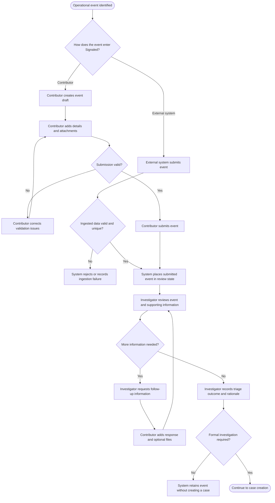
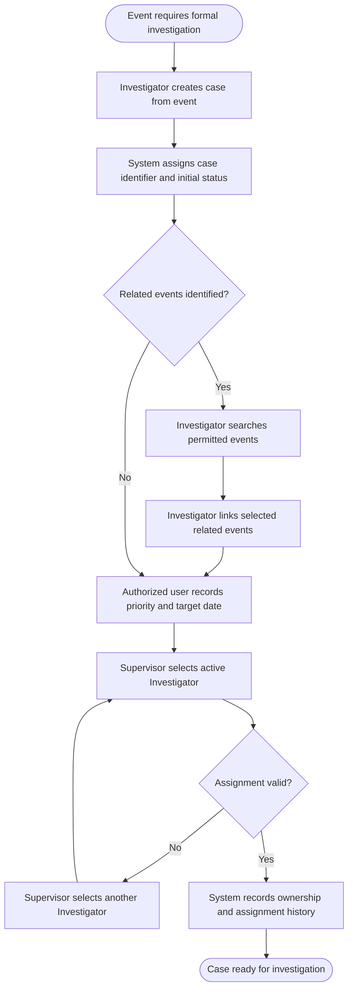
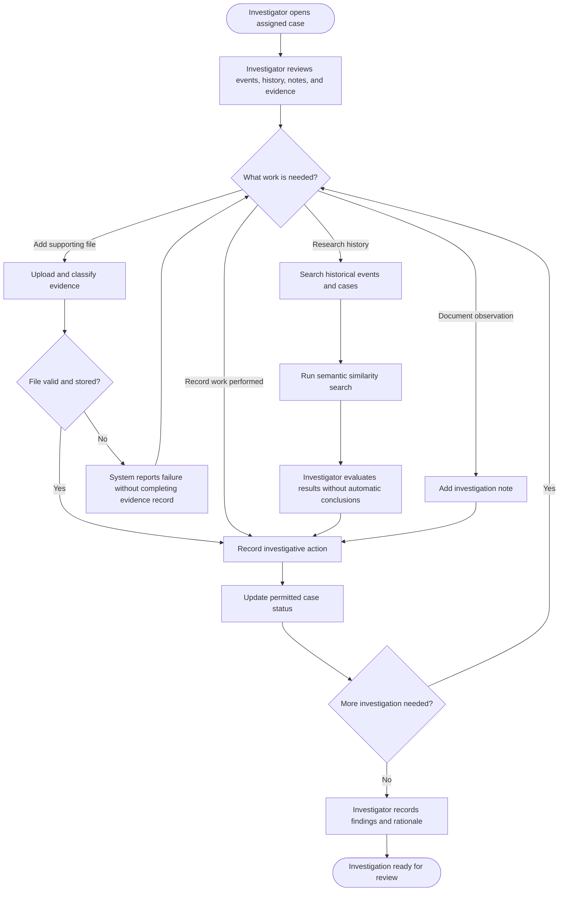
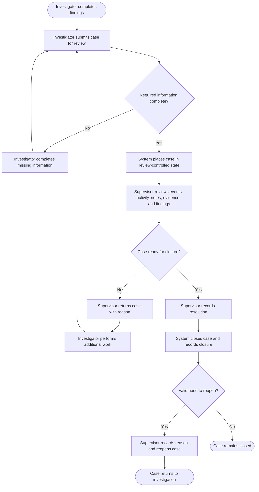
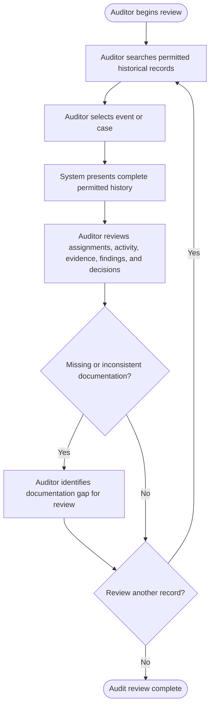
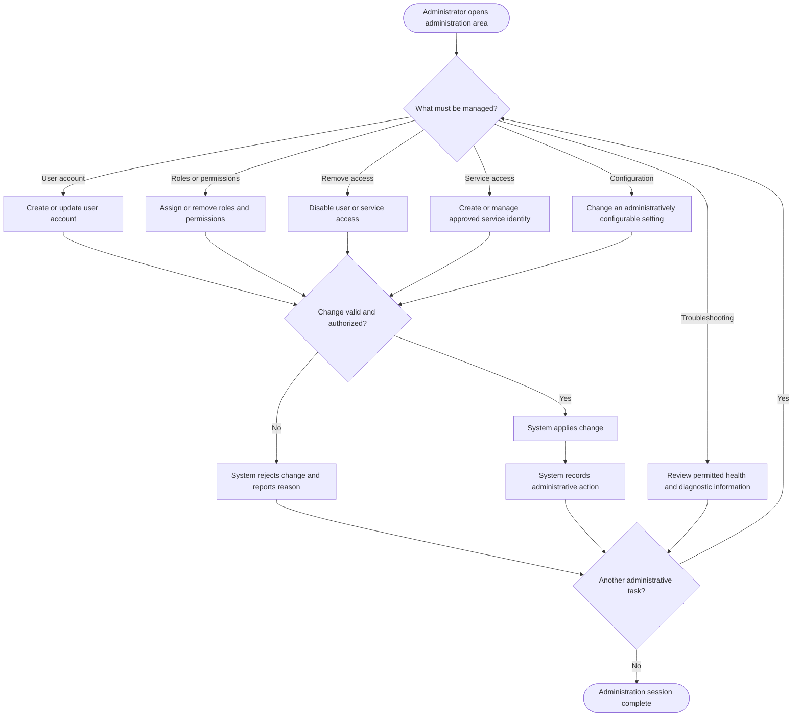

# Signaled User Flows

**Status:** Approved for MVP  
**Date:** September 22, 2026  
**Purpose:** Define the principal user and system workflows that connect Signaled's approved MVP requirements into complete operational processes.

---

## 1. Document Purpose

This document shows how Signaled's users and system components move through the major MVP workflows. The flows bridge the approved requirements and the later wireframe, architecture, data-model, API, security, testing, and implementation documents.

The diagrams are organized by business workflow rather than by persona. A single workflow may cross several roles because Signaled is intended to preserve responsibility, state, and history across the complete investigation lifecycle.

These flows define process behavior and decision points. They do not prescribe screen layouts, endpoint structures, database tables, or specific infrastructure implementations.

## 2. Diagram Conventions

- Rectangles represent user or system actions.
- Diamonds represent decisions.
- Rounded endpoints represent the beginning or outcome of a workflow.
- Solid arrows represent the primary or alternate path through a workflow.
- Each action identifies the responsible role or system when responsibility might otherwise be unclear.
- Authorization, validation, and audit requirements apply throughout the flows even when they are not repeated at every step.

## 3. Cross-Cutting Flow Rules

The following rules apply to every workflow in this document:

1. Signaled shall authenticate human users and trusted service identities before permitting protected actions.
2. Signaled shall authorize each requested action and record access according to the requesting identity's permissions and record-visibility scope.
3. Invalid, unauthorized, or conflicting actions shall be rejected without falsely changing the business state.
4. Security-sensitive and business-significant actions shall produce traceable audit records.
5. Corrections shall preserve history rather than silently replacing or deleting prior information.
6. Users shall receive understandable success, validation, authorization, and processing feedback appropriate to the interface.
7. System failures shall produce operational telemetry and shall not be presented as successful business outcomes.

---

## 4. Flow 1 — Event Intake and Triage

### 4.1 Purpose

This flow covers the creation or ingestion of an operational event, submission for review, follow-up information, and the triage decision that determines whether the event becomes part of a formal investigation.

### 4.2 Primary Actors

- Contributor
- Investigator
- Trusted external system
- Signaled

### 4.3 Entry Conditions

- A Contributor is authenticated and authorized to create events; or
- A trusted external system is authenticated through an approved service identity.

### 4.4 Flow Diagram

### 4.5 Key Rules and Alternate Paths

- A Contributor may save and edit an event while it remains an unsubmitted draft.
- Signaled shall not accept an event for review until required submission data is valid.
- An ingestion failure shall not create an event that appears successfully submitted.
- A duplicate external delivery shall not create a duplicate event when required idempotency information is available.
- A follow-up response supplements the submitted record and does not silently rewrite the original submission.
- The Investigator shall record both the triage outcome and its rationale.
- An event may remain in Signaled without becoming a case.
- Triage history shall remain traceable if a decision is later corrected.

### 4.6 Outcomes

- The event remains documented with a completed triage outcome and no case; or
- The event proceeds to the Case Creation and Assignment flow.

### 4.7 Requirement Coverage

`REQ-AUTH-001–009`, `REQ-EVT-001–020`, `REQ-TRI-001–008`, `REQ-EVD-001–005`, `REQ-ING-001–007`, `REQ-AUD-001–006`, `REQ-UI-001–005`

---

## 5. Flow 2 — Case Creation and Assignment

### 5.1 Purpose

This flow converts a significant triaged event into a formal case, connects related events, and establishes investigative responsibility.

### 5.2 Primary Actors

- Investigator
- Supervisor
- Signaled

### 5.3 Entry Conditions

- An authorized Investigator has recorded a triage decision requiring formal investigation.

### 5.4 Flow Diagram

### 5.5 Key Rules and Alternate Paths

- The originating event shall remain associated with the case.
- Multiple related events may be associated with one case.
- The same event shall not be linked to the same case more than once.
- Removing an association shall not delete the event, case, or association history.
- Only an active Investigator may receive an assignment.
- Assignment and reassignment shall preserve the complete ownership history.
- Search and linking actions shall expose only events the requesting user is permitted to access.

### 5.6 Outcome

- A uniquely identified case exists with its originating event, any selected related events, defined priority and timing information, and a responsible Investigator.

### 5.7 Requirement Coverage

`REQ-CASE-001–008`, `REQ-ASG-001–007`, `REQ-WFL-001`, `REQ-WFL-005`, `REQ-SRC-001–005`, `REQ-AUD-001–006`, `REQ-UI-001–005`

---

## 6. Flow 3 — Investigation and Evidence Management

### 6.1 Purpose

This flow covers the Investigator's active case work: reviewing case context, documenting investigative activity, managing evidence, searching historical information, and preparing findings.

### 6.2 Primary Actors

- Investigator
- Signaled
- Asynchronous processor

### 6.3 Entry Conditions

- The case is assigned to an Investigator.
- The case is in a status that permits investigative work.

### 6.4 Flow Diagram

### 6.5 Key Rules and Alternate Paths

- Only permitted case-status transitions shall be accepted.
- Notes and significant actions shall identify their actor and timestamp.
- Notes shall not be silently overwritten or removed.
- Evidence metadata shall identify the file, uploader, upload time, type, size, and associated record.
- A failed file-storage operation shall not produce a completed evidence record.
- Evidence access shall follow the authorization of its associated event or case.
- Structured and semantic search shall enforce record visibility.
- Semantic similarity is an investigative aid; it shall not automatically link records, classify events, assign responsibility, or determine findings.
- Failure of semantic search shall not prevent the Investigator from using structured search or continuing the case.

### 6.6 Outcome

- The case contains organized, traceable investigative work and documented findings ready for Supervisor review.

### 6.7 Requirement Coverage

`REQ-WFL-001–008`, `REQ-INV-001–007`, `REQ-EVD-001–010`, `REQ-SRC-001–010`, `REQ-RES-001–004`, `REQ-AUD-001–006`, `REQ-UI-001–005`

---

## 7. Flow 4 — Supervisor Review and Resolution

### 7.1 Purpose

This flow governs submission for Supervisor review, return for additional work, formal closure, and controlled reopening.

### 7.2 Primary Actors

- Investigator
- Supervisor
- Signaled

### 7.3 Entry Conditions

- The Investigator has recorded the required findings and supporting rationale.

### 7.4 Flow Diagram

### 7.5 Key Rules and Alternate Paths

- A case shall not enter Supervisor review until required investigation information is complete.
- Review-controlled information shall not be changed while awaiting review unless the case is returned for additional work.
- Returning a case shall require a documented reason.
- Closing a case shall require a documented resolution and shall identify the closing Supervisor and timestamp.
- A closed case shall be read-only except for explicitly permitted closed-case actions.
- Reopening shall require authorization and a documented reason.
- Reopening shall preserve the prior findings, resolution, closure information, and history.

### 7.6 Outcomes

- The case is returned to the Investigator for additional work;
- The case is formally closed with a documented resolution; or
- A previously closed case is reopened without losing its original history.

### 7.7 Requirement Coverage

`REQ-WFL-001–008`, `REQ-RES-001–012`, `REQ-AUD-001–009`, `REQ-UI-001–005`

---

## 8. Flow 5 — Audit Review

### 8.1 Purpose

This flow allows an Auditor to independently locate and review investigation records, supporting information, decisions, and historical activity without altering them.

### 8.2 Primary Actors

- Auditor
- Signaled

### 8.3 Entry Conditions

- The Auditor is authenticated and has permission to review the relevant records.

### 8.4 Flow Diagram

### 8.5 Key Rules and Alternate Paths

- Auditor access to investigation records shall be read-only.
- Search results and summaries shall include only records the Auditor is permitted to access.
- The case history shall allow reconstruction of material assignments, transitions, review decisions, closure, and reopening.
- Evidence review shall respect the authorization applied to its associated event or case.
- The system may identify missing required information, but it shall not automatically declare a compliance violation.
- Audit access itself shall be recorded when required by the approved security and compliance policy.

### 8.6 Outcome

- The Auditor completes an independent review using a trustworthy history without modifying the reviewed records.

### 8.7 Requirement Coverage

`REQ-SRC-001–005`, `REQ-AUD-001–011`, `REQ-EVD-005–008`, `REQ-UI-001–005`

---

## 9. Flow 6 — Administration and Access Management

### 9.1 Purpose

This flow covers user accounts, roles and permissions, service access, configurable settings, and review of administrative and operational activity.

### 9.2 Primary Actors

- Administrator
- Signaled
- Identity, configuration, and observability services

### 9.3 Entry Conditions

- The Administrator is authenticated and authorized for the requested administrative capability.

### 9.4 Flow Diagram

### 9.5 Key Rules and Alternate Paths

- Administrative capabilities shall follow least privilege and remain separated by permission.
- Disabling an account or service identity shall prevent new activity without deleting historical actions.
- Permission changes shall not alter the recorded identity of previous actions.
- Service identities shall receive only the permissions required for their approved responsibility.
- Only settings designated as administratively configurable may be changed through the application.
- Configuration changes shall be validated before application and recorded in the audit history.
- Diagnostic access shall be appropriate to the Administrator's role and shall not expose secrets or unnecessary investigative content.
- Invalid or unauthorized administrative changes shall be rejected without changing the current configuration or access state.

### 9.6 Outcome

- The authorized administrative change is validated, applied, and audited; or
- The change is rejected without altering the existing system state.

### 9.7 Requirement Coverage

`REQ-AUTH-001–009`, `REQ-ADM-001–007`, `REQ-CFG-001–008`, `REQ-AUD-001–006`, `REQ-OBS-001–008`, `REQ-UI-001–005`

---

## 10. Workflow Relationships

The six flows form one connected operational model:

1. **Event Intake and Triage** determines whether an operational event requires formal investigation.
2. **Case Creation and Assignment** establishes the case, its related events, and responsible Investigator.
3. **Investigation and Evidence Management** produces the documented work, evidence, and findings.
4. **Supervisor Review and Resolution** controls quality review, closure, and reopening.
5. **Audit Review** provides independent, read-only examination across the preserved history.
6. **Administration and Access Management** supports secure access, configuration, integrations, and operational troubleshooting across all other workflows.

The flows intentionally share authorization, audit, validation, and observability behavior. Those controls should be designed as consistent cross-cutting capabilities rather than reimplemented separately for each screen or endpoint.

## 11. Design Decisions Deferred to Later Documents

The following details remain intentionally outside this user-flow document:

- Screen layouts, navigation, interaction patterns, and component behavior
- Exact event, case, evidence, finding, and closure fields
- Authentication provider and sign-in implementation
- Complete permission catalog and record-visibility policies
- Exact case statuses and transition matrix
- API endpoints, request and response contracts, and error formats
- Database entities, relationships, indexes, and persistence mappings
- File-storage, message, retry, and dead-letter implementation details
- Selection of Azure Function or background worker
- Semantic-search technology and indexing architecture
- Performance targets, deployment topology, and environment configuration

These decisions will be resolved through the wireframe/prototype, architecture, ERD/data-model, API-contract, security, testing, and deployment documentation.
